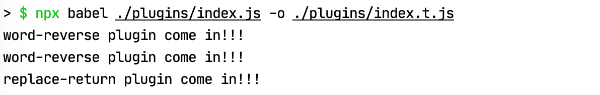

## 1. 什么是babel

> Babel is a toolchain that is mainly used to convert ECMAScript 2015+ code into a backwards compatible version of JavaScript in current and older browsers or environments. 
>
> Babel是一个工具链，主要用于将ECMAScript 2015+代码转换为当前和较老的浏览器或环境中的向后兼容的JavaScript版本。

### 1.1 我们能用bebel做什么？

- 针对于新出的ECMAScript标准，部分浏览器还不能完全兼容，需要将这部分语法转换为浏览器能够识别的语法。比如有些浏览器不能正常解析es6中的箭头函数，那通过babel转换后，就能将箭头函数转换为浏览器能够“认懂”得语法。

- 针对于一些较老的浏览器，比如IE10或者更早之前。对一些最新的内置对象`Promise/Map/Set`，静态方法`Arrary.from/Object.assign`以及一些实例方法`Array.prototype.includes`，这些新的特性都不存在与这些老版本的浏览器中，那么就需要给这些浏览器中的原始方法中添加上这些特性，即所谓的`polyfill`。

- 可以做一些源码的转换，即可以直接使用babel中提供的API对代码进行一些分析处理，例如

    - ```javascript
        const filename = 'index.js'
        const { ast } = babel.transformSync(source, { filename, ast: true, code: false });
        const { code, map } = babel.transformFromAstSync(ast, source, {
            filename,
            presets: ["minify"],
            babelrc: false,
            configFile: false,
        });
        ```

## 2. 使用babel

下面讲到的几种转换方式，其实本质上都是一样的，都是调用babel-core中的API来进行直接转换

### 2.1 使用babel.transform直接转换

```javascript
const source = `
const someFun = () => {
    console.log('hello world');
}
`;

require("@babel/core").transform(source, {
  plugins: ["@babel/plugin-transform-arrow-functions", "@babel/plugin-transform-parameters"],
}, result => {
  console.log(result.code);
});
```

### 2.1 使用babel-cli

babel提供了cli的方式，可以直接让我们使用命令行的方式来使用babel，具体参照一下做法

```shell
## install
## 首先需要安装 @babel/core @babel/cli
## @babel/cli是提供的命令行工具，会内部调用@babel/core来进行代码转换
npm install @babel/core @babel/cli --save-dev

## usage
npx babel ./cli/index.js
```

本地安装完依赖后，就可以使用babel来进行代码转换了，`npx babel [options] files`，babel提供了一些常用的cli命令，可以使用`npx babel --help`来查看

```shell
> $ npx babel --help                                                                                                           ⬡ 12.13.0 [±master ●●●]
Usage: babel [options] <files ...>

Options:
  -f, --filename [filename]                   The filename to use when reading from stdin. This will be used in source-maps, errors etc.
  --presets [list]                            A comma-separated list of preset names.
  --plugins [list]                            A comma-separated list of plugin names.
  --config-file [path]                        Path to a .babelrc file to use.
  --env-name [name]                           The name of the 'env' to use when loading configs and plugins. 																							 Defaults to the value of BABEL_ENV, or else NODE_ENV, or else 
                                              'development'.
```

下面是一个简单的例子，比如有这么一段源代码，

```javascript
// cli/index.js

const arrayFn = (...args) => {
    return ['babel cli'].concat(args);
}

arrayFn('I', 'am', 'using');
```

执行以下命令：`npx babel ./cli/index.js --out-file ./cli/index.t.js`，结果如下图：


代码和源代码竟然是一模一样的，为什么箭头函数没有进行转换呢？这里就会引入[plugins](https://babeljs.io/docs/en/plugins)以及[preset](https://babeljs.io/docs/en/presets)的概念，这里暂时不会具体讲解，只需要暂时知道，代码的转换需要使用plugin进行。

转换箭头函数，我们需要使用到`@babel/plugin-transform-arrow-functions/parameters`，首先安装完之后，在此执行转换

```shell
npm install @babel/plugin-transform-arrow-functions @babel/plugin-transform-parameters --save-dev
npx babel ./cli/index.js --out-file ./cli/index.t.js --plugins=@babel/plugin-transform-arrow-functions,@babel/plugin-transform-parameters
```

执行完之后，再看生成的文件


### 2.3 使用webpack babel-loader来进行转换

创建webpack.config.js，编写如下配置

```javascript
// install
npm install webpack-cli --save-dev

// webpack/webpack.config.js
module.exports = {
  entry: './index.js',
  output: {
    filename: 'index.bundle.js'
  },
  module: {
    rules: [
      {
        test: /\.m?js$/,
        exclude: /(node_modules|bower_components)/,
        use: {
          loader: 'babel-loader',
          options: {
            plugins: ["@babel/plugin-transform-arrow-functions", "@babel/plugin-transform-parameters"]
          }
        }
      }
    ]
  }
};

// usage
cd webpack
npx webpack
```

可以得到转换之后的代码如下：


可以对比查看babel-cli的转换之后的代码是一致的。

### 2.4 使用配置文件来进行转换

参看以上三种方式，都必须加载了plugins这个参数选项，尤其是在cli方式中，如果需要加载很多插件，是非常不便于书写的，同时，相同的配置也不好移植，比如需要在另外一个项目中同样使用相同的cli执行，那么显然插件越多，就会越容易出错。鉴于此，babel提供了config的方式，类似于webpack的cli方式以及config方式。

babel在7.0之后，引入了`babel.config.[extensions]`，在7.0之前，项目都是基于`.babelrc`来进行配置，这里暂时不会讲解它们之间的区别。下面就是一个比较基于上面例子的一个.babelrc文件。

```json
// .babelrc
{
  "plugins": ["@babel/plugin-transform-arrow-functions", "@babel/plugin-transform-parameters"]
}
```

我们将这个文件放置在根目录下，新建一个`config`的文件夹，从cli目录中将index.js文件copy到config目录下，然后执行`npx babel ./config/index.js --out-file ./config/index.t.js`，完成之后，会发现和cli执行的方式并没有什么差别。

## 3. babel.config.json vs .babelrc

babel.config.js是在babel第7版引入的，主要是为了解决babel6中的一些问题，参看[https://babeljs.io/docs/en/config-files#6x-vs-7x-babelrc-loading](https://babeljs.io/docs/en/config-files#6x-vs-7x-babelrc-loading)

- .babelrc会在一些情况下，莫名地应用在node_modules中
- .babelrc的配置不能应用在使用符号链接引用进来的文件
- 在node_modules中的.babelrc会被检测到，即使它们中的插件和预设通常没有安装，也可能在Babel编译文件的版本中无效

### 3.1 .babelrc在monorepo项目中的一些问题

另外如果只使用.babelrc，在monorepo项目中会遇到一些问题，这得从.babelrc加载的两条规则有关

- 在向上搜索配置的过程中，一旦在文件夹中找到了package.json，就会停止搜寻其它配置（babel用package.json文件来划定package的范围）
- 这种搜索行为找到的配置，如`.babelrc`文件，必须位于babel运行的root目录下，或者是包含在`babelrcRoots`这个option配置的目录下，否则找到的配置会直接被忽略

下面我们在之前的例子上进行改造，文件结构如下：


在mod1文件夹中创建一个package.json文件，内容为`{}`。现在执行以下代码：

```shell
npx babel ./config/mod1/index.js -o ./config/mod1/index.t.js
```

可以发现，index.js没有编译，因为在向上查找的时候，找到了mod1中的package.json，但是在此目录中并没有找到`.babelrc`文件，因此不会编译。

下面，我们将`.babelrc`文件移至mod1中，然后再执行上面的命令，这次会编译成功么？


答案依旧是不会，因为当前的执行目录是在src下面，所以在`mod1`目录中的配置文件将会被忽略掉。

这里有两种方法来解决这个问题：

- 进入到mod1目录中直接执行 `cd ./config/mod1 & npx babel index.js -o index.t.js`

- 在执行的root目录下，添加一个`babel.config.json`文件，在其中添加`babelrcRoots`将这个目录添加进去

  

  然后再执行`npx babel ./config/mod1/index.js -o ./config/mod1/index.t.js`就可以正常编译了。

  正是基于上述的一些问题，babel在7.0.0之后，引入了`babel.config.[json/js/mjs/cjs]`，基于babel.config.json的配置会灵活得多。

### 3.2 [Project-wide configuration](https://babeljs.io/docs/en/config-files#project-wide-configuration)

  一般`babel.config.json`会放置在根目录下，在执行编译时，babel会首先去寻找`babel.config.json`文件，以此来作为整个项目的根配置。

  如果在子目录中不存在.babelrc的配置，那么在编译时，会根据根目录下的配置来进行编译，比如在config/index.js中添加如下代码  

  执行`npx babel ./config/index -o ./config/index.t.js`后会发现`for..of`这段代码会被原样输出，因为在config目录中并没有针对`for..of`配置插件。现在在config文件中添加`.babelrc`，内容如下：

  ```json
  {
    "plugins": [
      "@babel/plugin-transform-for-of"
    ]
  }
  ```

  再次执行完，会发现，`for..of`会被babel编译


说明，如果子文件夹中存在相应的babel配置，那么编译项会在根配置上进行扩展。

但这点在`monorepo`项目中会有点例外，之前我在mod1文件家中放置了一个`package.json`文件：


执行下面命令

```shell
npx babel ./config/mod1/index.js -o ./config/mod1/index.t.js
```

发现`for..of`部分并没有被babel编译，这个原因和之前在讲bablerc的原因是一样的，因为执行的根目录是src，因此在mod1中并不能去加载.babelrc配置，因此只根据根目录中的配置来执行编译。想要mod1中的配置也被加载，可以按照相同的方法在`babel.config.json`中配置`babelrcRoots`。

另外如果子文件家中不存在相应的配置，比如在cli目录下，在src目录下执行config/index.js文件是没有问题的，但是如果进入cli中，然后直接执行，会发现index.js文件不会被编译。由此，你需要告诉babel去找到这个配置，这里可以使用`rootMode: upward`来使babel向上查找babel.config.json，并以此作为根目录。

```shell
cd cli & npx babel ./index.js -o ./index.t.js --root-mode upward
```

### 3.3 推荐使用场景

- babel.config.json 
  - 你正在使用一个`monorepo`（可以理解为在一个项目中会有多个子工程）
  - 你希望编译node_modules以及symobllinked-project中的代码
- .babelrc
  - 你的配置仅适用于项目的单个部分
  - 需要在子目录/文件中运行一些特定的转换，比如你可能不希望一些第三方库被转码
- **综合推荐使用babel.config.json，[Babel itself is using it](https://github.com/babel/babel/blob/master/babel.config.js)**

## 4. [plugins](https://babeljs.io/docs/en/plugins) & [Presets](https://babeljs.io/docs/en/presets)

> Babel is a compiler (source code => output code). Like many other compilers it runs in 3 stages: **parsing**, **transforming**, and **printing**.
>
> Now, out of the box Babel doesn't do anything. It basically acts like `const babel = code => code;` by parsing the code and then generating the same code back out again. You will need to add plugins for Babel to do anything.

没有plugins，babel将啥事也做不了。

babel提供了丰富的插件来对不同时期的代码进行转换。例如我们在es6最常使用的箭头函数，当需要转化为es5版本时，就用到了[arrow-functions](https://babeljs.io/docs/en/babel-plugin-transform-arrow-functions)这个插件。

具体的插件列表，可以查看[plugins](https://babeljs.io/docs/en/plugins)。

presets的中文翻译为预设，即为一组插件列表的集合，我们可以不必再当独地一个一个地去添加我们需要的插件。比如我们希望使用es6的所有特性，我们可以使用babel提供的[ES2015](https://babeljs.io/docs/en/plugins#es2015)这个预设。

### 4.1 基本用法

```json
// 如果plugin已经在发布到npm中
// npm install @babel/plugin-transform-arrow-functions -D
// npm install @babel/preset-react -D
{
  "plugins": ["@babel/plugin-transform-arrow-functions"],
  "presets": ["@babel/preset-react"]
}

// 或者按照babel的规范，引入自己编写的plugin/preset
{
  "plugins": ["path/to/your/plugin"],
  "presets": ["path/to/your/preset"],
}
```

### 4.2 选项

任何一个插件都可以拥有自定义的属性来定义这个插件的行为。具体的写法可以为：

```json
{
  "plugins": ["pluginA", ["pluginA"], ["pluginA", {}]],
  "presets": ["presetA", ["presetA"], ["presetA", {}]]
}

// example
{
  "plugins": [
    [
      "@babel/plugin-transform-arrow-functions",
      { "spec": true }
    ]
  ],
  "presets": [
    [
      "@babel/preset-react",
      {
        "pragma": "dom", // default pragma is React.createElement (only in classic runtime)
        "pragmaFrag": "DomFrag", // default is React.Fragment (only in classic runtime)
        "throwIfNamespace": false, // defaults to true
        "runtime": "classic" // defaults to classic
        // "importSource": "custom-jsx-library" // defaults to react (only in automatic runtime)
      }
    ]
  ]
}
```

### 4.3 执行顺序

- 插件执行顺序在[presets](https://babeljs.io/docs/en/presets)之前
- 插件会按照声明的插件列表顺序顺序执行(first to last)
- preset会按照声明的列表顺序逆序执行(last to first)

#### 4.3.1 plugin的执行顺序测试

下面我们来做几个例子测试一下，首先，官方给出的插件标准写法如下**[再次之前，强烈建议阅读[babel-handbook](https://github.com/thejameskyle/babel-handbook)来了解接下来插件编码中的一些概念]**：

```javascript
// 1. babel使用babylon将接受到的代码进行解析，得到ast树，得到一系列的令牌流，例如Identifier就代表一个字
// 符(串)的令牌
// 2. 然后使用babel-traverse对ast树中的节点进行遍历，对应于插件中的vistor，每遍历一个特定的节点，就会给visitor添加一个标记
// 3. 使用babel-generator对修改过后的ast树重新生成代码

// 下面的这个插件的主要功能是将字符串进行反转
// plugins/babel-plugin-word-reverse.js
module.exports = function() {
  console.log("word-reverse plugin will be executed firstly");
  return {
    visitor: {
      Identifier(path) {
        const name = path.node.name;
        path.node.name = name
          .split("")
          .reverse()
          .join("");
      },
    },
  };
}

// 然后我们再提供一个插件，这个插件主要是修改函数的返回值
// plugins/babel-plugin-replace-return.js
module.exports = function({ types: t }) {
  console.log("replace-return plugin will be executed lastly");
  return {
    visitor: {
      ReturnStatement(path) {
        path.replaceWithMultiple([
         t.expressionStatement(t.stringLiteral('Is this the real life?')),
         t.expressionStatement(t.stringLiteral('Is this just fantasy?')),
         t.expressionStatement(t.stringLiteral('(Enjoy singing the rest of the song in your head)')),
       ]);
      },
    },
  };
}
```

首先我们来测试一下原始代码是否通过我们自定义的插件进行转换了，源代码如下：

```javascript
// plugins/index.js
const myPluginTest = (javascript) => {
  return 'I love Javascript';
}

// 然后在plugins目录下创建一个.babelrc文件，用于继承默认的babel.config.json文件
// plugins/.babelrc
{
  "plugins": ["./babel-plugin-word-reverse", "./babel-plugin-replace-return"]
}

// usage
npx babel ./plugins/index.js -o ./plugins/index.t.js
```

以下是执行完之后的结果


从截图可以看出，字符串被反转了，以及返回的字符串也被替换掉了。

然后我们再来看看执行的顺序



可以看到，排在插件列表之前的插件会在提前执行。

#### 4.3.2 preset的执行顺序测试

下面再新建一个插件，用于自定义的preset编写

```javascript
// presets/babel-plugin-word-replace.js
// 这个插件主要的功能是给每个节点类型为Identifier的名称拼接一个_replace的后缀
module.exports = function() {
  console.log("word-replace plugin will be executed firstly");
  return {
    visitor: {
      Identifier(path) {
        let name = path.node.name;
        path.node.name = name += '_replace';
      },
    },
  };
}
```

然后我们借助之前编写的`babel-plugin-word-reverse`来编写两个新的presets

```javascript
// presets/my-preset-1.js
module.exports = () => {
  console.log('preset 1 will be executed lastly');
  return {
    plugins: ['../plugins/babel-plugin-word-reverse']
  };
};

// presets/my-preset-2.js
module.exports = () => {
  console.log('preset 2 will be executed firstly');
  return {
    presets: ["@babel/preset-react"],
    plugins: ['./babel-plugin-word-replace', '@babel/plugin-transform-modules-commonjs'],
  };
};

// 创建.babelrc配置
// presets/.babelrc
{
  "presets": [
    "./my-preset-1",
    "./my-preset-2"
  ]
}

// 测试代码
// presets/index.jsx
import React from 'react';

export default () => {
  const text = 'hello world';
  return <div>{text}</div>;
}

// 执行
npx babel ./presets/index.jsx -o ./presets/index.t.js
```

可以看到在.babelrc中，将preset-1放在了preset-2的前面，如果按照babel官网给出的解析，那么preset2会被先执行，执行的顺序如下


可以看到控制台打印的顺序尽然是顺序执行的，这点与**官网给出的preset执行顺序是相反的？？？**

然后再看编译之后生成的文件，发现竟然又是先执行了preset-2中的插件，然后在执行preset-1中的插件，如图：


可以看到显然是首先经过了添加后缀`_replace`，然后在进行了整体的`reverse`。这里是不是意味着，在presets列表中后声明的preset中的插件会先执行呢？？？


## 参考链接

- [babeljs.io](https://babeljs.io/docs/en/)
- [babel详解（七）-配置文件](https://blog.liuyunzhuge.com/2019/09/09/babel详解（七）-配置文件/)
- [Babel快速上手使用指南](https://juejin.im/post/6844903858632654856)

